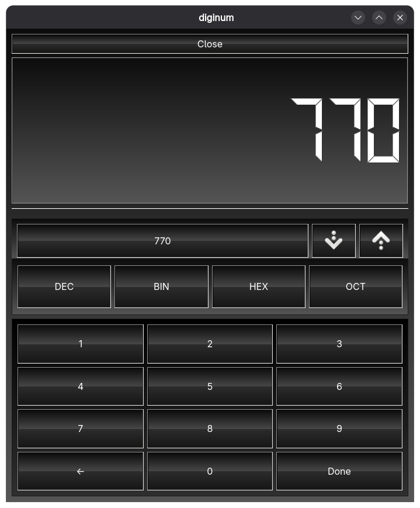

# Diginum (C++ Version)
A slightly better version of SandCount that supports more platforms, rewriten in C++ (from the same ui file - thanks `uic`

NOTE: While the mobile UI is used by default, you can still type into it (i used keyboard shortcuts for it)

There's also a TV mode (doesn't really work the best) which is just mobile mode in full screen

## Installation

`curl https://raw.githubusercontent.com/ActuallySandPotNoodles/diginum-cpp/refs/heads/main/install.sh | sudo bash`

<s>You can also use the Arch package (if your on arch)</s> //not done yet

You might have to logout and then log back in again for it to show up as an option in you application menu.

## Build

First clone the repository, navigate to the created directory

Then install `qt6-base-devel` using your distro's package manager

Then

`mkdir build; cd build`

`cmake ..`

`make`

### Install your build
After that, you can manually move the file you get from this (`diginum_cpp`) to `/usr/bin` under the name `diginum` (without the `_cpp` at the end)

`sudo cp ./diginum_cpp /usr/bin/diginum`

Then get the icon file from here and put it in `/usr/share/sandpotnoodles`

And get the desktop file and place it in `/usr/share/applications`
